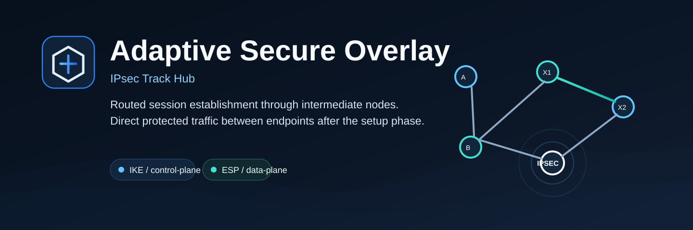

# Adaptive Secure Overlay - IPsec Track Hub



Adaptive IPsec Overlay is the active IPsec/IKE research track inside the wider
Adaptive Secure Overlay organization. It routes IKE control traffic through
selected intermediate nodes and then lets ESP data traffic continue directly
between endpoints after the IPsec SA is established.

This repository is the main hub for the current public implementation track.
Platform packages and forward-looking branches live in separate repositories:

- [adaptive-ipsec-overlay-linux](https://github.com/Adaptive-Secure-Overlay/adaptive-ipsec-overlay-linux):
  Linux endpoint/intermediate node package with strongSwan integration.
- [adaptive-ipsec-overlay-openwrt](https://github.com/Adaptive-Secure-Overlay/adaptive-ipsec-overlay-openwrt):
  OpenWRT endpoint/intermediate node package with strongSwan integration.
- [adaptive-ipsec-overlay-routeros7](https://github.com/Adaptive-Secure-Overlay/adaptive-ipsec-overlay-routeros7):
  MikroTik RouterOS v7 container profile for intermediate overlay operation.
- [adaptive-secure-overlay-windows](https://github.com/Adaptive-Secure-Overlay/adaptive-secure-overlay-windows):
  future Windows endpoint and client track.
- [adaptive-secure-overlay-wireguard](https://github.com/Adaptive-Secure-Overlay/adaptive-secure-overlay-wireguard):
  future WireGuard compatibility track.

This hub keeps the shared project view, common assets, and combined
documentation for the current lab implementation.

## Repository family

| Repository | Role | Notes |
| --- | --- | --- |
| `adaptive-ipsec-overlay` | Hub | Shared docs, assets, project overview |
| `adaptive-ipsec-overlay-linux` | Package | Linux endpoint/intermediate node |
| `adaptive-ipsec-overlay-openwrt` | Package | OpenWRT endpoint/intermediate node |
| `adaptive-ipsec-overlay-routeros7` | Package | RouterOS 7 intermediate relay profile |
| `adaptive-secure-overlay-windows` | Track | Planned Windows endpoint/client branch |
| `adaptive-secure-overlay-wireguard` | Track | Planned WireGuard compatibility branch |

## Platform profiles

| Platform | Package repo | Role | Installer | Notes |
| --- | --- | --- | --- | --- |
| Linux | `adaptive-ipsec-overlay-linux` | Endpoint and intermediate | `install.sh` | strongSwan, nftables, XFRM bypass, systemd |
| OpenWRT | `adaptive-ipsec-overlay-openwrt` | Endpoint and intermediate | `install.sh` | strongSwan, nftables, init.d |
| RouterOS 7 | `adaptive-ipsec-overlay-routeros7` | Intermediate only | `install-container.rsc` | RouterOS container package, overlay relay daemon |

## Current status

This is a research prototype, not a production VPN client. Use it in a lab first.

The Linux/OpenWRT path intercepts local IKE UDP/500 and IKE-over-UDP/4500,
forwards the IKE datagrams through the overlay, then leaves ESP (`IP proto 50`)
to flow directly between endpoints.

The MikroTik path is intermediate-only. It runs the overlay daemon in a RouterOS
container and does not make RouterOS a strongSwan ESP endpoint.

## Scope of this track

The active public implementation is centered on adaptive establishment for
IPsec-style secure channels:

- multi-hop control-plane traversal during setup;
- split route knowledge across selected intermediate nodes;
- direct ESP-style data-plane after security associations are established;
- lab validation across Linux, OpenWRT, RouterOS, and EVE-NG scenarios.

The broader organization name stays protocol-agnostic on purpose. Windows and
WireGuard remain separate tracks so the research is not locked to a single
transport family.

## Configuration

Each platform package ships with `examples/overlay.sample.json`. Copy and edit
that file for the target node:

```bash
cp examples/overlay.sample.json /etc/adaptive-ipsec-overlay/overlay.json
```

Each user entry needs:

- `ip`: node underlay IP address.
- `port`: overlay UDP port, usually `9000`.
- `password`: shared lab secret for the current prototype.

For real deployments, replace all sample passwords.

## Linux install

Dedicated package:

- [adaptive-ipsec-overlay-linux](https://github.com/Adaptive-Secure-Overlay/adaptive-ipsec-overlay-linux)

On a Debian/Ubuntu endpoint:

```bash
sudo NODE_NAME=User1 CONFIG_SOURCE=examples/overlay.sample.json ./linux/install.sh
```

The installer copies code to `/opt/adaptive-ipsec-overlay`, writes
`/etc/adaptive-ipsec-overlay/env`, installs a systemd template service and starts:

```bash
systemctl status adaptive-ipsec-overlay@User1
journalctl -u adaptive-ipsec-overlay@User1
tail -f /var/log/hybrid-overlay-User1.log
```

## OpenWRT install

Dedicated package:

- [adaptive-ipsec-overlay-openwrt](https://github.com/Adaptive-Secure-Overlay/adaptive-ipsec-overlay-openwrt)

Copy this repository or release tarball to the OpenWRT router, then run:

```bash
NODE_NAME=User11 CONFIG_SOURCE=examples/overlay.sample.json ./openwrt/install.sh
```

Check service state:

```bash
/etc/init.d/adaptive-ipsec-overlay status
tail -f /var/log/hybrid-overlay-User11.log
```

## MikroTik intermediate install

Dedicated package:

- [adaptive-ipsec-overlay-routeros7](https://github.com/Adaptive-Secure-Overlay/adaptive-ipsec-overlay-routeros7)

Edit and import:

```routeros
/import file-name=install-container.rsc
```

## Security note

The current prototype still uses shared per-node passwords in `overlay.json`.
Do not publish your real lab config. The example configs contain placeholders.
